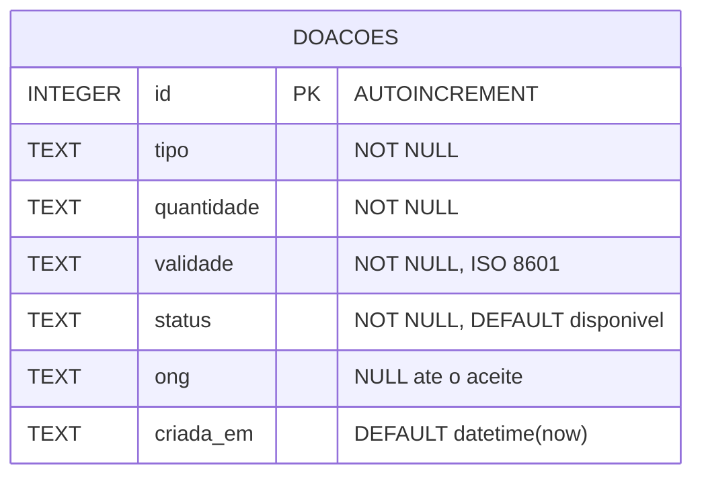
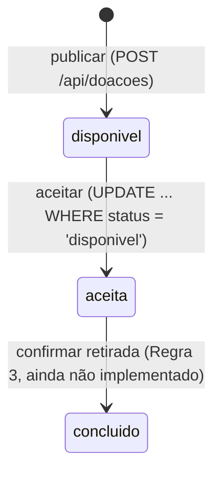
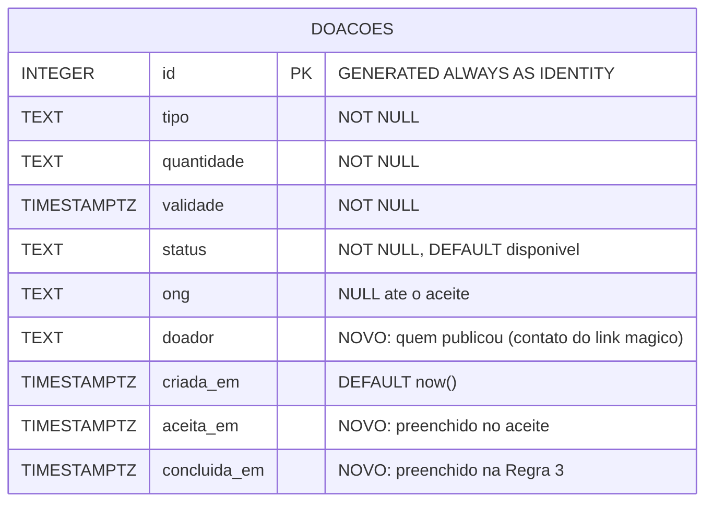

# Diagrama de dados — Prato Cheio

*Pergunta que este diagrama responde:* o que o banco guarda sobre cada doação e como o aceite muda o estado do lote?

A versão original (Aula 7) está em `docs/aulas/Análise e Modelação de SistemaProjeto_ Prato Cheio.pdf`, seção 2. Esta é a versão atualizada em 08/10/2026, depois da revisão do [ADR 0001](../adr/0001-migracao-sqlite-postgresql.md), que acrescentou a cópia mensal do banco para a Vigilância Sanitária.

## Hoje (o que o `src/db.js` cria)

Transição de estados, por `UPDATE` na própria linha (não existe tabela de aceites):

## Planejado para a Unidade 3 (PostgreSQL, ADR 0001 e Revisão)

As três colunas novas existem para que a cópia mensal mostre à Vigilância **quem publicou** (Conflito 1) e **quando** cada lote mudou de estado. Sem elas, a cópia mostraria só o estado atual de cada linha.

## Divergências declaradas

| # | Onde diverge | Diagrama ou documento | Código (`src/`) | O que fazemos |
|---|---|---|---|---|
| 1 | Nome do estado após o aceite | Análise (Regra 2) e PDF da Aula 7: `RESERVADO` / `reservado` | `repositorio.js` grava `'aceita'`, e o teste espera `'aceita'` | Mantido `aceita` no código até a Unidade 3. Trocar exige mudar teste, então fica fora da refatoração do banco e entra como decisão própria |
| 2 | Estado final | Regra 3 e PDF: `CONCLUIDO` | não existe: a História 8 não foi implementada | Aguarda a Marta ratificar a Regra 3 (Retrospectiva 1) |
| 3 | Coluna de versão do lock otimista | Decisão de projeto #1: "coluna de versão no lote, `… AND version = X`" | não existe: o `UPDATE` usa só `WHERE status = 'disponivel'` | Para um único campo de estado, a condição no status já garante a exclusividade. A coluna de versão fica sem uso enquanto o lote não tiver outros campos editáveis |
| 4 | Quem publicou e quando houve o aceite | Conflito 1 e Revisão do ADR 0001: precisa constar na cópia mensal | não existe: não há `doador`, `aceita_em` nem `concluida_em` | Planejado acima, a criar no schema PostgreSQL na Unidade 3 |
| 5 | Tipo das datas | Planejado: `TIMESTAMPTZ` | `TEXT` em SQLite | Muda junto com a migração (ADR 0001, consequência negativa de dialeto) |
