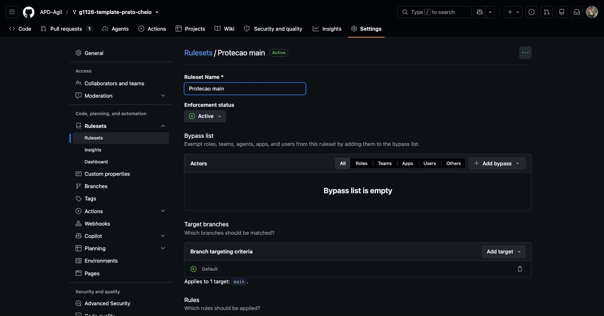
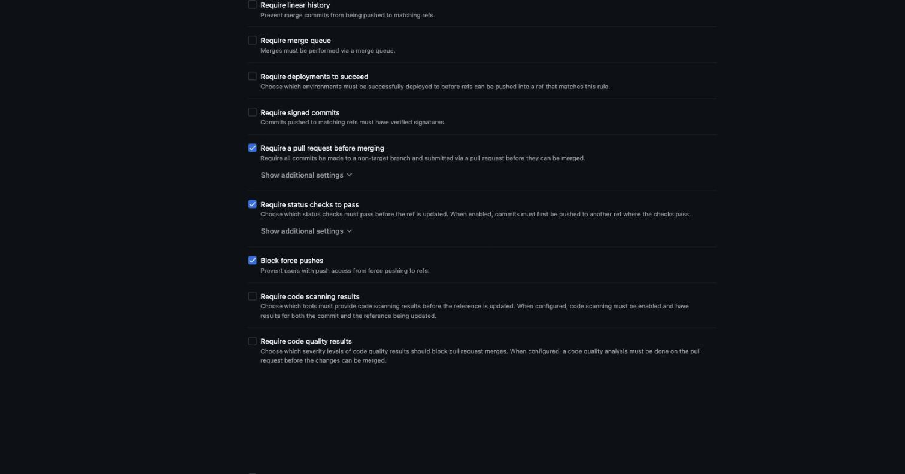

# Evidência — Proteção da branch `main`

*Entregue no primeiro Pull Request do grupo, a partir do qual nada mais entra na `main` sem PR revisado por outro integrante e com CI verde.*

## O que foi ativado

- Repositório: `APD-Agil/g1126-template-prato-cheio`
- Branch protegida: `main`
- Mecanismo: Ruleset "Protecao main" (Settings → Rules → Rulesets), com status **Active**
- Ativado por: **Willian Vinicius Ramalho (@willianramalho)**
- Data: **18/09/2026**

Regras habilitadas no ruleset (target branch: `main`, via "Include default branch"):

- [x] Require a pull request before merging
- [x] Require approvals — mínimo de **1** aprovação
- [x] Require status checks to pass before merging — check obrigatório: `build-e-testes` (workflow `.github/workflows/ci.yml`), com "Require branches to be up to date before merging" também ativado
- [x] Bypass list vazia — a regra se aplica a todos, inclusive administradores do repositório (nenhum ator foi adicionado à lista de bypass)

> Nota: o GitHub substituiu a página clássica "Branch protection rules" por **Rulesets** nesta versão da plataforma — a opção de exigir número de aprovações só está disponível nessa tela nova. O resultado é equivalente ao pedido (PR obrigatório + 1 aprovação + CI verde + sem bypass), só muda o caminho de configuração.

## Print da configuração

## Como isso passa a valer

A partir desta entrega, todo merge na `main` exige:
1. Pull Request aberto (sem push direto na `main`);
2. Revisão de pelo menos um outro integrante do grupo — solicitada a revisão do Henrique (@hosmar27) no PR #2, primeiro PR do grupo;
3. CI (`build-e-testes`) verde, com a branch atualizada em relação à `main` antes do merge.

Essa regra vale até o fim do semestre e é critério de aceite do Trabalho 2.
